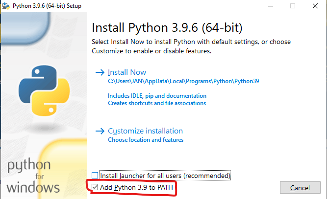

# Installing Python and MIKE IO

1. Download Python from [https://www.python.org/downloads/](https://www.python.org/downloads/)
2. Install Python (Select Add Python to PATH)

3. (On PCs without MIKE Zero) Install [VC redist](https://aka.ms/vs/16/release/vc_redist.x64.exe)
4. Open command prompt (`cmd.exe`)
5. Install MIKE IO (`pip install mikeio`)
6. Install [JupyterLab](https://jupyterlab.readthedocs.io/en/stable/) (`pip install jupyterlab`)
5. Start Jupyter lab (`jupyter lab`)
6. You are now ready to start working with MIKE IO in Python

## Installation example

